# 数美滑块逆向笔记

***声明***   
本文章中所有内容仅供学习交流使用，不用于其他任何目的，不提供完整代码，抓包内容、敏感网址、数据接口等均已做脱敏处理，严禁用于商业用途和非法用途，否则由此产生的一切后果均与作者无关！   
目标网站
> `YUhSMGNITTZMeTkzZDNjdWFYTm9kVzFsYVM1amIyMHZkSEpwWVd3dlkyRndkR05vWVM1b2RHMXM=`


## 分析
1. 我们需要明确目标文件是什么，既然解决滑块问题，那我们是不是就应该先拿到滑块的图片，再去分析。那么先清空缓存，防止文件过多干扰定位文件。     
当我们把控制台清空之后，点击登录先不着急滑动滑块，直接将滑块关闭，我们可以看到生成了以下的图片。
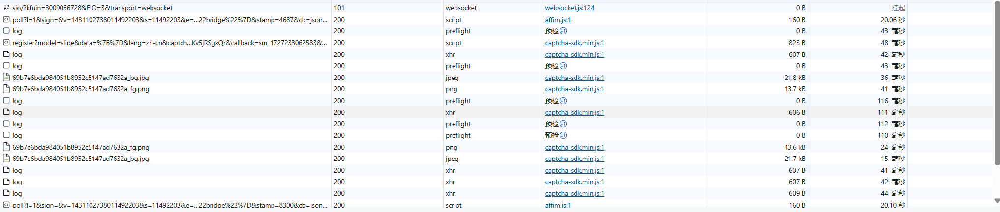
2. 紧接着我们就要定位是哪个请求携带了图片的链接。     
我们很容易就找到了这个文件     
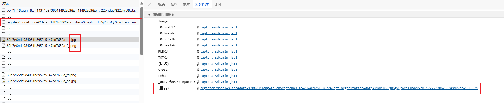             
3. 分析生成图片需要携带什么参数       
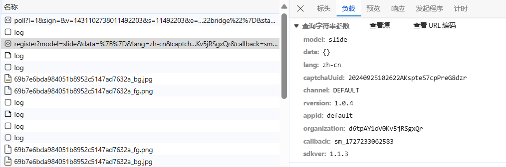       
然后再看看它的响应     
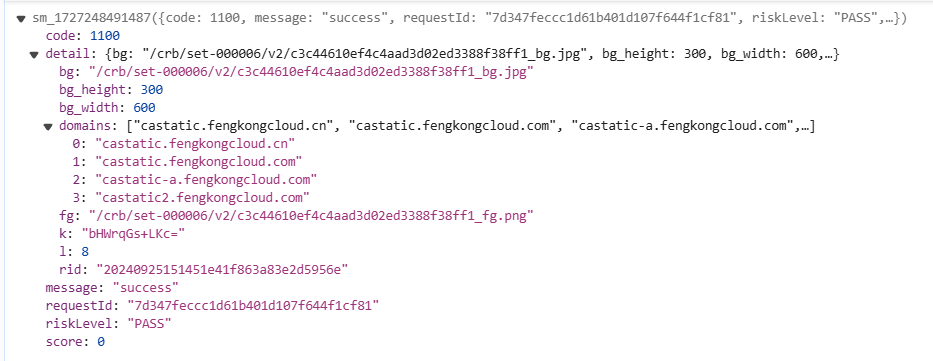    
其中 `bg` 是背景图片，`fg` 是滑块，文字点选、空间推理中 `order` 是提示信息，`k、l、rid` 三个参数后续会用到。
4. 再次清空控制台，点击登录，然后滑动滑块，分别尝试失败和成功的情况，分析生成的对应文件的参数     
我们会发现`fverify`这个文件就是我们需要的，因此我们就可以定位到这个文件了,下面是他的请求参数    
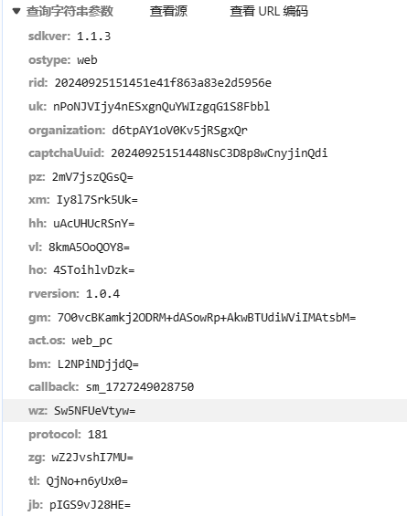      
有很多个参数，大都是通过 JS 生成的，其参数名会根据 `captcha-sdk.min.js` 的变化而变化，其中有个最长的类似于下图的 `gm` 值，包含了轨迹加密。(名字不一样很正常哦)
通过查看它的响应我们知道了一个重要的点`riskLevel`表示本次滑动是否通过验证   通过为`PASS` 反之为`REJECT`
5. 那我们就需要知道如何去伪造这个发包请求了，明确好了目标，接下来逆向开始！

## ~~快乐~~ 逆向
1. 伪造获取图片   
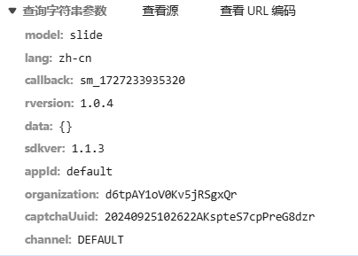    
通过postman调试知道几个重点参数(其他参数带上即可)
`model`: `slide` 滑块、`auto_slide` 无感验证、`select` 文字点选、`icon_select` 图标点选、`seq_select` 语序点选、`spatial_select` 空间推理
`capchaUuID`: 我们需要找一下
`organization`：每个站点的`captchaUuid`是固定的，姑且可以看成固定的组织ID   

2. 通过搜索大法我们找到了一个它生成的位置,进去一看有一个解密函数，加密函数，大数组，位移。典型的ob没跑了(但是本人采用暴力破解，不解混，这个网站本身也有检测，不过压缩一下代码就可以了，也没啥)。很庆幸capchaUuID的数量不多，如果不知道要断那个，那就全部断上。
虽然我们一眼就可以看到`getCaptchaUuid`这个方法，但是发现简单的打断点是进不去这个函数，由于他的混淆，我们不能明确的知道这个函数它做了什么，所以我们需要另辟蹊径，就是跟栈。
跟栈费神这边简单指明一下思路，查看`register`这个包的的栈，能发现切入点是在`smcp.min.js`文件中，通过关键词断点确定     
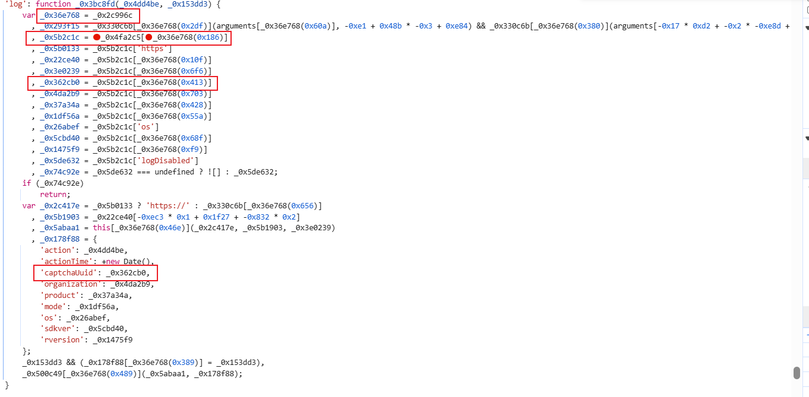
断点刷新，继续跟栈，我们发现     
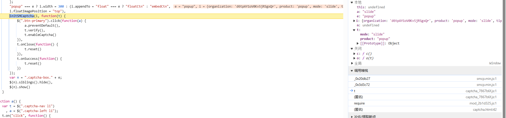     
`init`很奇特，我们进去看看，果不其然，我们想要的东西就在里面     
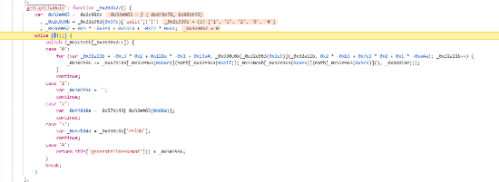     
3. 折腾半天，让我们来分析一下这个函数。   
一个很标准的控制流平坦化，但是足够简单运行逻辑也如上图所示
那我们就很容易还原这个算法(就是把每一个部分去控制台打印出来看看逻辑即可，很简单)。还原如下:

```js
function generateTimeFormat() {
    var e = new Date()
    , t = function(n) {
        return +n < 10 ? "0" + n : n.toString();
    };
    return ((e.getFullYear().toString() + t(e.getMonth() + 1)) + t(e.getDate()) + t(e.getHours()) + t(e.getMinutes())) + t(e.getSeconds());
}

function getCaptchaUuid() {
    var c = "";
    var o = "ABCDEFGHJKMNPQRSTWXYZabcdefhijkmnprstwxyz2345678";
    var s = o.length;
    for (var a = 0; a < 18; a++) {
        c += o.charAt(Math.floor(Math.random() * s));
    }
    return generateTimeFormat() + c;
}
```

4. 图片的参数我们已经完成了，接下来就是重头戏，伪造成功验证的代码了。老样子，直接跟栈。<s>搜索关键字 `getEncryptContent`更快</s>
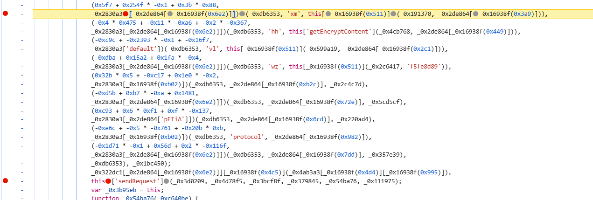
分析如下(我推荐大家把解完混淆的代码输出出来方便自己理解，我懒就没写):
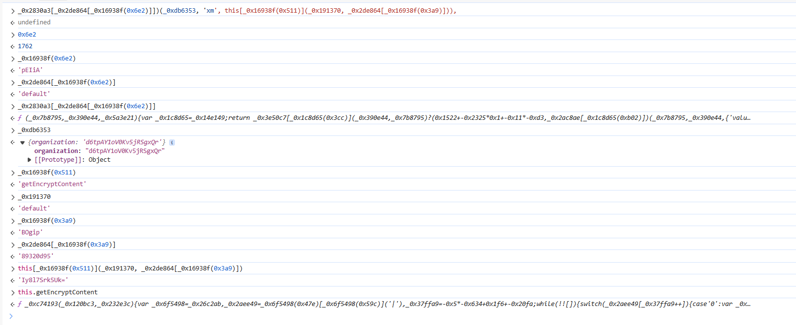
这个getEncryptContent便是逆向的重点了，让我们更跟进去看看他做了什么。
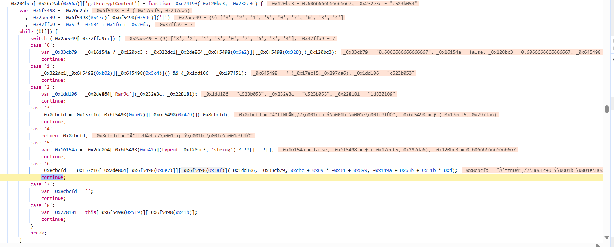
又是一个控制流平坦化，那就只能慢慢来咯。     
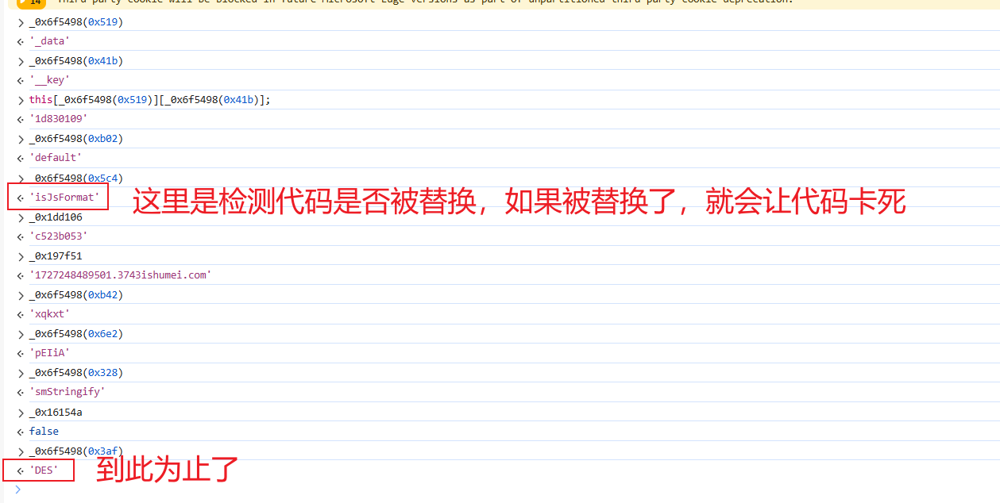
有一个 `isJsFormat` 的格式化检测函数，正常应该是 `false` 的，如果你格式化了就为 `true`，也就会导致 `f` 的值为时间戳加数美的域名，这个 `f` 值后续是 `DES` 的 `Key`，不对的话自然怎么滑都不会通过。
不过我们纯粹的扣代码也是没有问题的***这里必须还原，不然你都不知道key是什么***
详细分析知道这个是一个标准的DES，那么还原代码如下:

```js
var CryptoJS = require("crypto-js")

function DESEncrypt(key, word) {
    var key_ = CryptoJS.enc.Utf8.parse(key);
    var srcs = CryptoJS.enc.Utf8.parse(word);
    var encrypted = CryptoJS.DES.encrypt(srcs, key_, {
        mode: CryptoJS.mode.ECB,
        padding: CryptoJS.pad.ZeroPadding
    });
    return encrypted.toString();
}

function DESDecrypt(key, word) {
    var key_ = CryptoJS.enc.Utf8.parse(key);
    var decrypt = CryptoJS.DES.decrypt(word, key_, {
        mode: CryptoJS.mode.ECB,
        padding: CryptoJS.pad.ZeroPadding
    });
    return decrypt.toString(CryptoJS.enc.Utf8);
}
```
根据混淆代码，我们知道上面这个方法只能解4个参数，那么剩下的参数该如何寻找呢。让我们向上看看
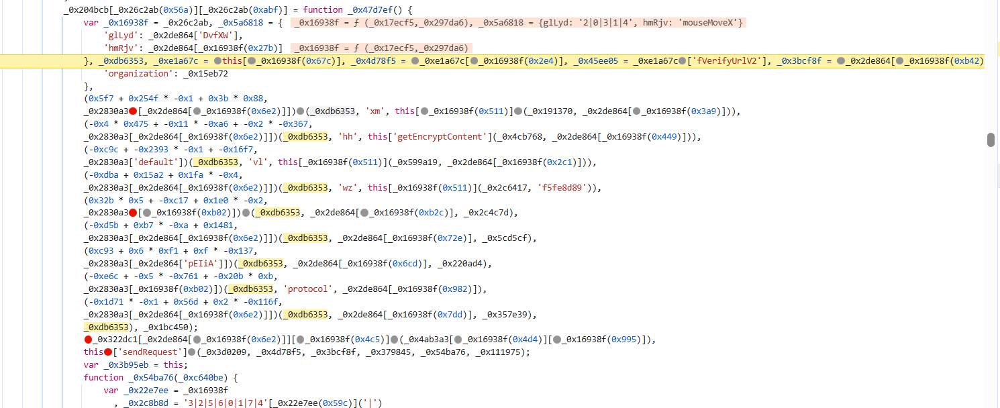
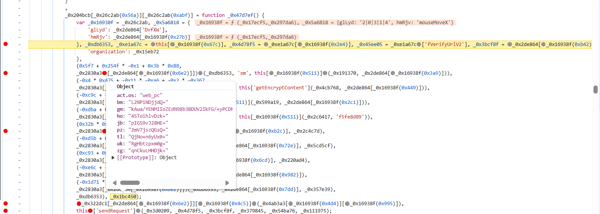
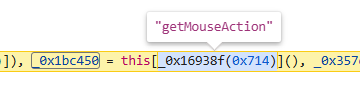   
终于水落石出啊，在控制台打印该函数并跟进，我们发现又双叒叕是个控制流平坦化，那咋办，慢慢来咯。
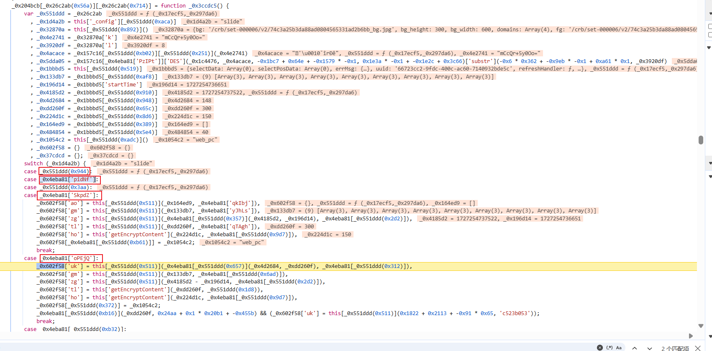
根据`mode` 模式的不同走不同的`case`。这里`mode`指的是滑块 点选等等等。我实在是写麻了。
~~简单来还原一下~~

```js 滑块
/* 
track：滑动轨迹（x, y, t），distance：滑动距离，randomNum：生成两数之间的随机值，示例：
var track = [[0, -2, 0], [62, 1, 98], [73, 4, 205], [91, 3, 303], [123, -3, 397], [136, 8, 502], [160, 0, 599], [184, 0, 697], [169, 0, 797]]
var distance = 169
 */

var baseData = {}
baseData.mouseData = track
baseData.startTime = 0
baseData.endTime = track[track.length - 1][2] + randomNum(100, 500)
baseData.mouseEndX = distance
baseData.trueWidth = 300
baseData.trueHeight = 150
baseData.selectData = []
baseData.blockWidth = 40

```

```python 滑块轨迹生成代码
import random
from loguru import logger 

def get_sm_track(distance):
    track_length = random.randint(4, 10)
    track = [[0, -2, 0]]
    m = distance % track_length
    e = int(distance / track_length)
    for i in range(track_length):
        x = (i + 1) * e + m + random.randint(20, 40)
        y = -2 + (random.randint(-1, 10))
        t = (i + 1) * 100 + random.randint(-3, 5)
        if i == track_length - 1:
            x = distance
            track.append([x, y, t])
        else:
            track.append([x, y, t])
    logger.info("track: %s" % track)
    return track
```

```js 点选类（文字点选 select、图标点选 icon_select、语序点选 seq_select、空间推理 spatial_select）
/*
coordinate：点选坐标（x, y），randomNum：生成两数之间的随机值，示例：
var coordinate = [[171, 101], [88, 102], [138, 109], [225, 100]]
 */

var baseData = {}
var time_ = new Date().getTime()
coordinate.forEach(function(co) {
    co[0] = co[0] / 300
    co[1] = co[1] / 150
    co[2] = time_
    time_ += randomNum(100, 500)
})
baseData.mouseData = coordinate
baseData.startTime = time_ - randomNum(800, 20000)
baseData.endTime = coordinate[coordinate.length - 1][2]
baseData.mouseEndX = 0
baseData.trueWidth = 300
baseData.trueHeight = 150
baseData.selectData = coordinate
baseData.blockWidth = undefined
```

```js 无感（auto_slide）
/*
randomNum：生成两数之间的随机值
*/

var baseData = {}
baseData.mouseData = [[0, 0, 0]]
baseData.startTime = 0
baseData.endTime = randomNum(100, 500)
baseData.mouseEndX = 260
baseData.trueWidth = 300
baseData.trueHeight = 150
baseData.selectData = []
baseData.blockWidth = 40
```

这些值生成完了之后，就是挨个通过 `getEncryptContent` 进行加密，前面已经分析过，实际上就是 `DES` 加密，可以看到分为点选、滑块和无感三类，其中 `DES Key` 也是会每隔一段时间变化的。    
总体上繁琐＞难度，嫌麻烦其实都可以不用还原代码，直接扣也能跑。
